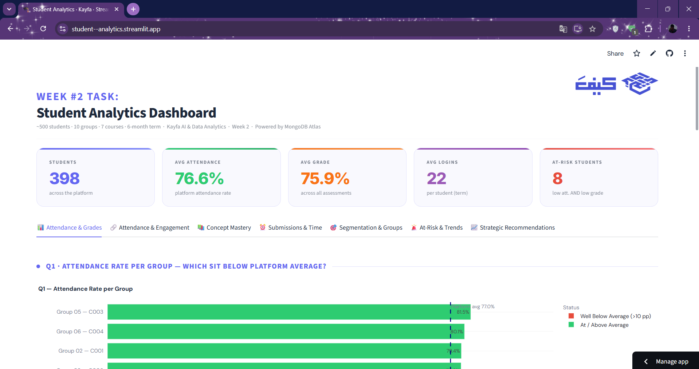
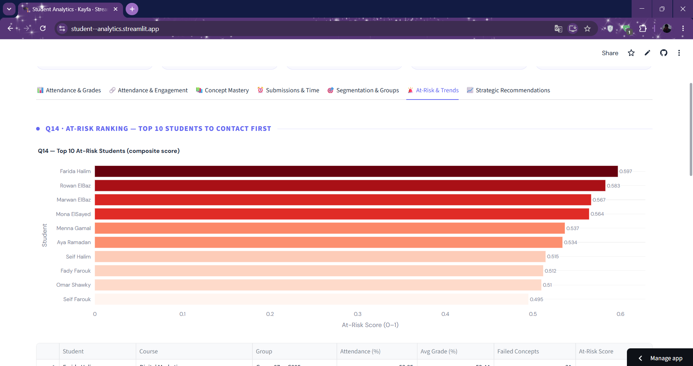

<div align="center">

[](https://git.io/typing-svg)

[](https://python.org)
[](https://pandas.pydata.org)
[](https://plotly.com)
[](https://streamlit.io)
[](https://mongodb.com)

> **8 files. 3 formats. 37 data defects. One interactive story to uncover.**

| 🎓 Total Students | 📉 Avg Attendance | 🏆 Avg Grade | 🔍 Analysis Questions |
|:-----------------:|:-----------------:|:-------------:|:---------------------:|
| **~500** | **~75%** | **~68%** | **15** |

**[🚀 Try the Live Dashboard →](https://your-app-link.streamlit.app/)**

</div>

## ✦ Dashboard Preview

### 📊 Executive Overview & KPIs
<p align="center">
  
</p>

### 🎯 Student Segmentation & Risk Analysis
<p align="center">
  
</p>

---

## ✦ What is This?

An end-to-end data analytics project built for the **Kayfa AI & Data Analytics Internship · Week 2 Evaluation**.

> *"How do our students learn — and who is at risk of falling behind?"*

This project tackles a complex, messy dataset spread across **CSVs, JSON, and Multi-sheet Excel workbooks**. It involves rigorous data cleaning (fixing 37 planted defects), multi-source joins, and advanced analytics including **K-Means Clustering** and **At-Risk Scoring**, all served via a high-performance **MongoDB Atlas** backend.

---

## ✦ Project Structure

```
kayfa-student-analytics/
├── 📓 student_analytics_cleaning.ipynb     ← Data Cleaning & Quality Audit (37 Issues)
├── 📓 student_analytics_questions.ipynb    ← The 15 Questions Analysis & MongoDB Upload
├── 🎛️ app.py                              ← Streamlit Dashboard (6 Tabs)
├── 📋 requirements.txt                    ← Dependencies
├── 🖼️ images/                             ← Dashboard screenshots
└── 📊 data/                               ← Raw dataset (8 files)
```

---

## ✦ The Pipeline

| # | Phase                  | What Happens |
|---|------------------------|-------------|
| 1 | **Load & Reconcile**   | Extract 8 files from 3 formats; flatten nested JSON; unify 6 Excel sheets. |
| 2 | **Cleaning Rigour**    | Fix **37 planted defects**: duplicates, impossible ages, broken logic, messy status encodings. |
| 3 | **Multi-source Joins** | Merge Students, Groups, Courses, Grades, and Engagement into unified model. |
| 4 | **Precomputed Analytics** | Calculate heavy metrics (clustering, trends) and push to **MongoDB Atlas**. |
| 5 | **Interactive Dashboard** | Multi-page Streamlit app with KPIs, Plotly visuals, and action plans. |

---

## ✦ The 15 Academic Questions

| #     | Question                                      | Difficulty    |
|-------|-----------------------------------------------|---------------|
| Q1-Q3 | Attendance per group & Course-level performance | 🟢 Medium    |
| Q4-Q5 | Attendance/Engagement ↔ Grade correlations     | 🟡 Hard      |
| Q6-Q7 | Curriculum weak spots & Concept mastery        | 🟡 Hard      |
| Q8-Q10| Procrastination effect, Cohort dips & Age      | 🟡 Hard      |
| Q11   | **Student Segmentation:** High-achievers vs At-Risk | 🔴 Very Hard |
| Q12-Q13| Headcount discrepancies & Group viability     | 🔴 Very Hard |
| Q14   | **At-Risk Ranking:** Top 10 students          | 🔴 Very Hard |
| Q15   | **Group Grade Trends:** Trending up vs down   | 🔴 Very Hard |

---

## ✦ Key Findings & Action Plan

| # | Finding | Recommended Action |
|---|--------|-------------------|
| 1 | Strong **Attendance ↔ Grade** correlation | Early intervention below 60% attendance |
| 2 | **Login Frequency** > Video watch time | Gamify daily logins |
| 3 | Concept weak spots in specific modules | Redesign weakest concepts |
| 4 | **Disengaged At-Risk** segment via K-Means | Automated check-in emails |
| 5 | Non-viable groups (< 5 students) | Merge with closest-profile groups |

---

## ✦ Dashboard Features

- **Sidebar Filters** — Course, Group, Demographics  
- **Live KPIs** — Headcount, Avg Attendance, Avg Grade, At-Risk Count  
- **6 Interactive Tabs**: Headlines, Drivers, Curriculum, Behaviour, Segments, Intervention

---

## ✦ Tech Stack

| Layer       | Technology                          |
|-------------|-------------------------------------|
| Language    | Python 3.10                         |
| Analysis    | Pandas · NumPy · Scipy              |
| ML          | Scikit-Learn (K-Means)              |
| Charts      | Plotly                              |
| Database    | MongoDB Atlas                       |
| Dashboard   | Streamlit                           |

---

## ✦ Quick Start

1. **Install Dependencies**
   ```bash
   pip install -r requirements.txt
   ```

2. Create `.env` file with your `MONGO_URI`

3. **Run the Dashboard**
   ```bash
   streamlit run app.py
   ```

<div align="center">
Built with ⚡ for Kayfa AI & Data Analytics Internship · Week 2<br>
Synthetic dataset — patterns are realistic but not real-world data.
</div>
